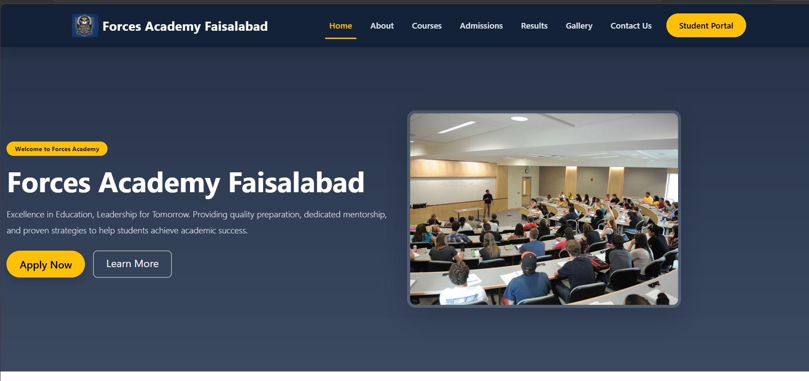
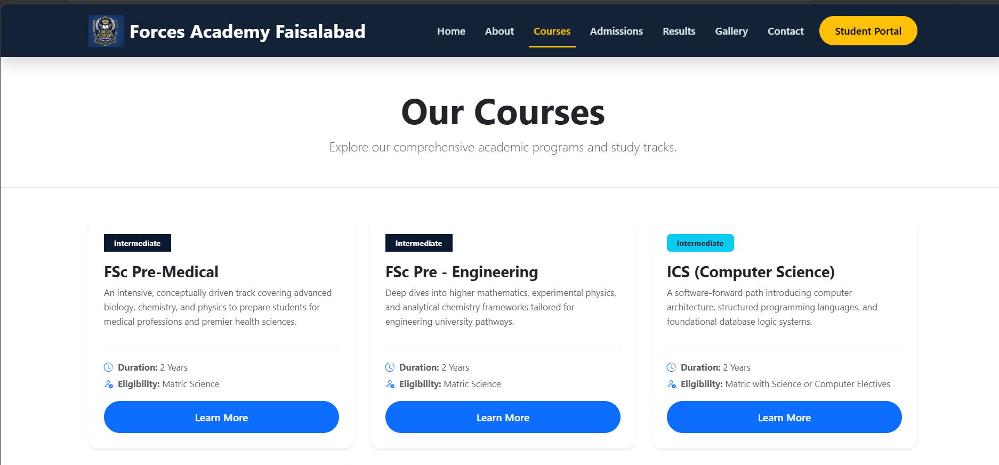
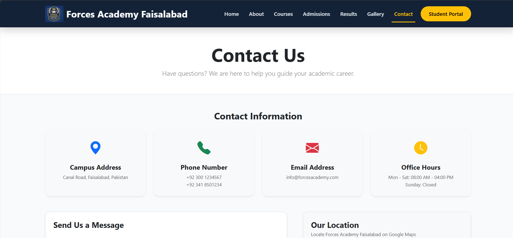

# Forces Academy Faisalabad - Website

A clean and user-friendly website for Forces Academy Faisalabad. It helps students easily find course details, admission steps, exam results, and academy updates.

## Live Demo
[Click Here to Visit the Site](https://maham211.github.io/forces-academy-frontend-codesaviours-SI-26-maham/)[cite: 1]

## Screenshots
| Home Page | Courses Page | Contact Us |
| :---: | :---: | :---: |
|  |  |  |

## Technologies Used
* **HTML5** & **CSS3** (Custom Styling & Design)[cite: 1]
* **Bootstrap 5.3** (Responsive Layout)[cite: 1]
* **Bootstrap Icons** (UI Icons)[cite: 1]
* **GLightbox** (Interactive Image Gallery)[cite: 1]

## Main Features
* **Simple Navigation:** Easy-to-use header menu and student portal button.
* **Interactive Design:** Smooth hover effects, image gallery lightbox, and back-to-top button.
* **Fully Responsive:** Works smoothly on mobiles, tablets, and computers.
* **Dark Mode:** Easy toggle switch for dark and light views.

## How to Run Locally
1. Download or clone this repository:
   ```bash
   git clone [https://github.com/maham211/forces-academy-frontend-codesaviours-SI-26-maham.git](https://github.com/maham211/forces-academy-frontend-codesaviours-SI-26-maham.git)
---
**Built by:** [Maham Asif] | Code Saviours SI-26 | 2026
