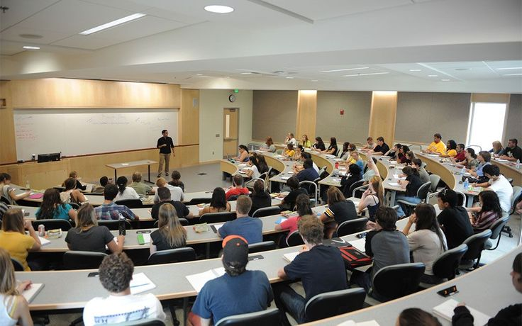

# Forces Academy Faisalabad - Web Portal

An educational web application built for Forces Academy Faisalabad to provide students with course details, admissions info, results tracking, and gallery highlights.

## Live Demo
[View Live Site on GitHub Pages]( https://maham211.github.io/forces-academy-frontend-codesaviours-SI-26-maham/)

## Screenshots
| Home Page | Courses Page | Contact Us |
| :---: | :---: | :---: |
|  |  |  |

## Tech Stack Used
* **Frontend:** HTML5, CSS3 (Custom Variables & Modern Layouts)
* **Framework:** Bootstrap v5.3.0
* **Icons:** Bootstrap Icons v1.11.3
* **Plugins:** GLightbox (for Image Lightbox Gallery)

## Key Features
* **Unified Design System:** Consistent typography (`Poppins`), color variables, and responsive navigation.
* **Distinct Student Portal Call-To-Action:** Visual styling for quick access.
* **Interactive Components:** Hover card effects, image gallery lightbox filters, back-to-top navigation, and responsive carousel/grids.
* **Fully Responsive Layout:** Optimized across desktop, tablet, and mobile viewports.

---
**Built by:** [Maham Asif] | Code Saviours SI-26 | 2026